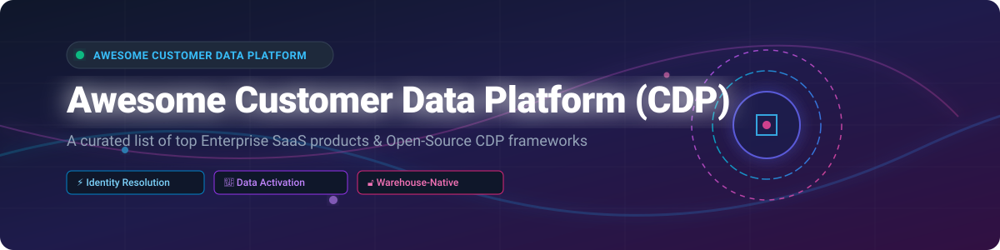

# 🚀 Awesome Customer Data Platform (CDP)

  
  
  
  
  

> ⚡ **A curated list of top Enterprise SaaS Customer Data Platforms & Open-Source CDP GitHub Frameworks.**
>
> 🎯 *Focused on Customer Data Unification, Identity Resolution, Audience Segmentation, Reverse ETL & Real-Time Data Activation.*

---

## 💡 What is a Customer Data Platform (CDP)?

A **Customer Data Platform (CDP)** is a centralized software system that aggregates, unifies, and cleanses customer behavioral, transactional, and demographic data from multiple sources to create a persistent **Single Customer View (360-degree customer profile)**. Modern CDPs support real-time identity resolution, automated audience segmentation, reverse ETL, and omnichannel activation for marketing automation, analytics, and privacy compliance (GDPR/CCPA).

---

## 📖 Table of Contents

- [☁️ SaaS & Enterprise CDP Platforms](#️-saas--enterprise-cdp-platforms)
- [🔓 Open-Source CDP Frameworks & GitHub Projects](#-open-source-cdp-frameworks--github-projects)
- [🤝 How to Contribute](#-how-to-contribute)
- [☕ Support & Sponsorship](#-support--sponsorship)
- [⚠️ Disclaimer](#-disclaimer)
- [📊 Star History](#-star-history)

---

## ☁️ SaaS & Enterprise CDP Platforms

> 📊 **Market Context**: The global Customer Data Platform (CDP) market size was estimated at **~$5.7 Billion in 2024–2025** and is projected to reach **~$28+ Billion by 2032** (CAGR ~27.5%). The market is **moderately concentrated** at the top enterprise tier dominated by cloud hyperscalers (*Microsoft, Salesforce, Oracle, Adobe*), while remaining **fragmented** in mid-market and specialized composable/warehouse-native verticals (*Segment, RudderStack, ActionIQ, HighTouch, Census*).

The following table lists leading enterprise SaaS Customer Data Platforms sorted by company size/revenue (descending):

| Platform | Description | Pricing (Starting Tier) | Free Tier Limits | Company Size / Valuation |
| :--- | :--- | :--- | :--- | :--- |
| **[Microsoft Dynamics 365 Customer Insights](https://dynamics.microsoft.com/)** | **Microsoft's enterprise CDP.** Unifies customer transactional, behavioral, and observational data into AI-driven profiles. | **$1,500/month** base fee (includes 100,000 profiles) + **$1,000/month** per additional 100k profiles. | **No permanent free tier** (Includes **30-day full feature trial** capped at 10,000 test profiles). | **~$281.7B Revenue** (Microsoft FY2025) |
| **[Oracle Unity CDP](https://www.oracle.com/cx/customer-data-platform/)** | **AI-powered B2B & B2C enterprise CDP.** Built into Oracle CX cloud with deep compliance & identity resolution. | **$3,000/month** (starting tier based on 100k profile blocks and data intake volume). | **No permanent free tier** (Includes **30-day Oracle Cloud Free Tier** with $300 cloud credits). | **~$57.4B Revenue** (Oracle FY2025) |
| **[Salesforce Data Cloud](https://www.salesforce.com/data/)** | **Hyperscale real-time enterprise CDP.** Formerly Salesforce Genie / Customer 360 Audiences powered by Einstein AI. | **$108,000/year** ($9,000/month starting contract for 100k profile credits). | **No permanent free tier** (Includes **30-day Developer Org / Hands-on Sandbox** trial). | **~$37.9B Revenue** (Salesforce FY2025) |
| **[Adobe Real-Time CDP](https://business.adobe.com/products/real-time-customer-data-platform/RT-CDP.html)** | **Enterprise B2B & B2C CDP.** Built natively on Adobe Experience Platform with privacy-by-design governance. | **$125,000/year** (starting enterprise base package based on total profile volumes). | **No permanent free tier** (Includes **custom enterprise sandbox demo** upon request). | **~$21.5B Revenue** (Adobe FY2025) |
| **[Segment (Twilio)](https://segment.com/)** | **Developer-first CDP category pioneer.** Offers 450+ pre-built integrations, event streaming, and schema governance. | **$120/month** (Team plan starting tier for up to 10,000 MTUs). | **Free forever plan available** (Limited to **1,000 Monthly Tracked Users (MTUs)**, 2 sources, 1 destination). | **~$4.4B Revenue** (Twilio FY2025) |
| **[Tealium AudienceStream](https://tealium.com/products/audiencestream-cdp/)** | **Privacy-focused enterprise CDP.** Deep tag management heritage with 1,200+ integrations and HIPAA compliance. | **$50,000/year** (~$4,166/month entry subscription level). | **No permanent free tier** (Includes **14-day guided proof-of-concept trial** for qualified enterprises). | **~$125M Estimated Revenue** (Private) |
| **[mParticle](https://www.mparticle.com/)** | **Mobile-first enterprise CDP.** Infrastructure for unified customer data layer across mobile apps and web. | **$3,500/month** (Growth plan starting tier). | **No permanent free tier** (Includes **30-day free trial** with 50,000 events limit). | **$300M Acquisition** (Acquired by Rokt) |
| **[ActionIQ](https://www.actioniq.com/)** | **Hybrid & warehouse-native enterprise CDP.** Enables marketers to query data warehouses directly without copying data. | **$45,000/year** (Starting subscription tier for composable CDP module). | **No permanent free tier** (Includes **custom enterprise sandbox environment**). | **$250M Acquisition** (Acquired by Uniphore) |
| **[Treasure Data](https://www.treasuredata.com/)** | **Enterprise Customer Data Platform.** Sub-second latency for profile lookups and customer data unification. | **$48,000/year** (~$4,000/month entry enterprise baseline package). | **No permanent free tier** (Includes **14-day enterprise trial**). | **$234M Total Funding** (SoftBank Subsidiary / Private) |
| **[BlueConic](https://www.blueconic.com/)** | **Pure-play pure first-party CDP.** Specialized in real-time cross-channel identity resolution and segmentation. | **$36,000/year** (~$3,000/month starting baseline contract). | **No permanent free tier** (Includes **30-day guided trial**). | **$115M Private Equity** (Vista Equity Partners) |

---

## 🔓 Open-Source CDP Frameworks & GitHub Projects

The following table lists top open-source Customer Data Platforms, Segment alternatives, and data collection pipelines sorted by **GitHub Star Count (descending)**:

| Repo | Description | Stars |
| :--- | :--- | :--- |
| **[Odoo CRM & Marketing](https://github.com/odoo/odoo)** | **Open-source suite featuring CRM & Customer Data Management.** Comprehensive platform for customer data, multi-channel marketing campaigns, lead scoring, and customer interaction analytics. |  |
| **[RudderStack](https://github.com/rudderlabs/rudder-server)** | **Mature warehouse-first open-source CDP.** Segment API-compatible event streaming, data pipelines, and reverse ETL engine for customer data warehouses. (ELv2 License). |  |
| **[Jitsu](https://github.com/jitsucom/jitsu)** | **Open-source Segment alternative & event streaming pipeline.** Lightweight, MIT-licensed data collection framework for web/mobile apps to data warehouses. |  |
| **[Pimcore](https://github.com/pimcore/pimcore)** | **Open-core Customer Data Platform (CDP) & Experience Cloud.** Consolidates customer data management, PIM, MDM, and digital asset management. |  |
| **[Tracardi](https://github.com/Tracardi/tracardi-api)** | **Composable open-source CDP engine.** API-first low-code platform for customer data collection, profile unification, and real-time marketing automation. |  |
| **[Apache Unomi](https://github.com/apache/unomi)** | **Apache Top-Level Project & OASIS CDP Reference Implementation.** Java-based customer data platform for profile management, privacy (GDPR), and personalization. |  |
| **[Cairo](https://github.com/outcome-driven-studio/cairo)** | **Self-hosted Segment alternative & AI-native CDP.** Node.js + PostgreSQL event pipeline with identity resolution, tracking plans, and LLM agent tracking MCP server. |  |
| **[LEO CDP](https://github.com/trieu/leo-cdp-framework)** | **AI-first open-source Customer Data Platform.** Privacy-friendly framework featuring ML customer 360, RFM segmentation, CLV predictive modeling, and LLM personalization. |  |

---

## 🤝 How to Contribute

Contributions are welcome! Please follow these simple guidelines:

1. Fork this repository.
2. Edit `README.md` to add your proposed SaaS product or Open-Source CDP project.
3. Ensure description remains factual, accurate, and includes valid pricing/star details.
4. Open a Pull Request with a clear title and description.

Check out [Awesome List Guidelines](https://github.com/ishandutta2007/Awesome-Awesome-Awesome) for general best practices.

---

## ☕ Support & Sponsorship

If you found this curated list of Customer Data Platforms helpful, consider supporting the project:

- 🌟 **Star this repository** on GitHub.
- 🔀 **Fork and share** with fellow data engineers and marketing technology teams.
- 💖 **Buy me a coffee / Sponsor the project**: Support further open-source research and maintenance via [GitHub Sponsors](https://github.com/sponsors/ishandutta2007).

---

## ⚠️ Disclaimer

- This repository is a **community-curated list** provided for educational and research purposes.
- All product names, logos, and brands are property of their respective owners.
- **Privacy & Compliance**: Customer Data Platforms process personal identifiable information (PII). Ensure strict compliance with global privacy regulations including GDPR, CCPA, and HIPAA.

---

## 📊 Star History

